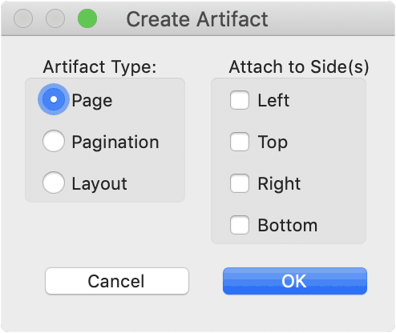

Decorative and unimportant information must be marked as artifact so that it can be ignored by [assistive technology (AT)](/glossary/#assistive-technology). If artefacts cannot be defined in the authoring software, this must be done manually in Acrobat.

<NoteMessage>
Find out in the glossary what <Link to="/glossary/#artifact/">artifacts</Link> are and what examples of them are.
</NoteMessage>

The most efficient way is to determine the artifacts already in the creation program and to include them in the PDF export. The following instructions are available for this purpose:

- [Defining Artifacts in InDesign](/basics/indesign/defining-artifacts-in-indesign/)
- [Defining Artifacts in Word](/basics/word/defining-artifacts-in-word/)

In Acrobat, artifacts can be defined either in the [tag tree](#create-artifact-in-navigation-pane-tags) or with “[Reading Order](#create-artifact-with-reading-order-tool)” tool. The contents marked as artifacts can be checked for each page in the navigation pane “[Content](#check-artifacts-in-navigation-pane-content)”.

<NoteMessage>
Note: The free <a href="https://get.adobe.com/reader/">Adobe Acrobat Reader</a> does not allow you to make any adjustments to the tag structure neither to edit the artifacts. You’ll need <a href="https://acrobat.adobe.com/uk/en/acrobat.html">Adobe Acrobat</a> to do that.
</NoteMessage>

## Create artifact in navigation pane “Tags”

For this tutorial, the initial situation is a completely tagged document.

1. Open the navigation pane “Tags” 
The navigation pane “Tags” can be opened by clicking on the icon with the name tag.  

If it is not yet listed in the left bar, it can be added with a right click or under “Display” → “Show/Hide” → “Navigation Pane” and the Navigation Pane will be displayed.
2. Find the decorative content within the tags, see also “[Find tagged text in the tag tree](/basics/acrobat/general-working-with-pdf-tags-in-acrobat/#find-tagged-text-in-the-tag-tree)” within “[General working with PDF tags in Acrobat](/basics/acrobat/general-working-with-pdf-tags-in-acrobat/)”.
3. Right-click on the content (with the small box icon) and select “Change Tag to Artifact”. 
3. The opening dialog allows you to describe the type of artifact and its page position in more detail. 
4. If this artifact was placed alone within a tag, the empty tag should be deleted.

## Create artifact with “Reading Order” tool

With the “Reading Order” tool it goes faster. On the other hand, you can work less precisely and cannot see exactly where what is happening.

1. Select the “Reading Order” tool. If you don’t have it in your “Quick Tools”, you can find it within the Accessibility tools group.
2. Your mouse will change and a new window will open.
3. Select the area you want to mark as artifact. You can do this by clicking in the upper left corner or by clicking and holding the mouse and dragging a selection square.
4. Finally click on the button “Background/Artifact” in the window.

## Check artifacts in navigation pane “Content”

If already tagged items are marked as artifacts, they disappear in the tag tree. However, artifacts are still present in the “Content” navigation pane. They can be recognized by the marking: “Container `<Artifact>` …”.

<NoteMessage>
In the “Contents” navigation pane, the element that is at the top is at the lowest position. The order of this listing and the display order is therefore reversed. In this context, the following problem may occur: „<Link to="/tutorials/general/incorrect-display-order-makes-contents-disappear/">Incorrect display order makes contents disappear</Link>“
</NoteMessage>