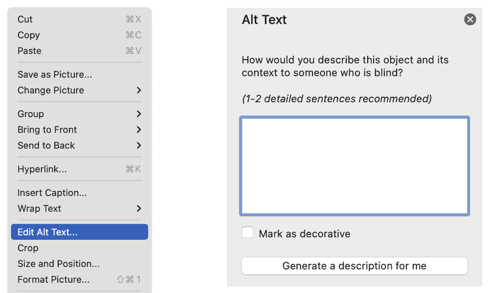

An alt text (short for alternative text) describes a non-text element, such as a photo or graphic. The invisible text can be read and rendered by software, especially [assistive technology (AT)](/glossary/#assistive-technology).

In the glossary you can learn more about what an [alt text](/glossary/#alt-text) is and how it should look like. In this tutorial, we’ll look how to add an alt text in InDesign.

## Add an alt text in Microsoft Word 365 or 2019

1. Right-click on the image (alternatively, you can click with the Ctrl key pressed)
2. Select “Edit Alt Text”
3. In the area “Alt text” you can now describe the image in one or two sentences

## Add an alt text in Microsoft Word 2016 or 2013

1. Right-click on the image (alternatively, you can click with the Ctrl key pressed)
2. Select „Format Picture“
3. Click the third tab “Layout and Properties” in the opened area and write your alt text in “Alt Text” → “Description”.

## PDF export

By taking the above measures and using the correct export settings, the alternative texts will be included when exporting as PDF. The export settings are described in [“Defining PDF tags in Word”](/basics/word/defining-pdf-tags-in-word/).

<NoteMessage>
  Images and graphics are tagged with the <code>&lt;Figure&gt;</code> tag. The alt text defined in
  InDesign is applied to this tag.
</NoteMessage>
